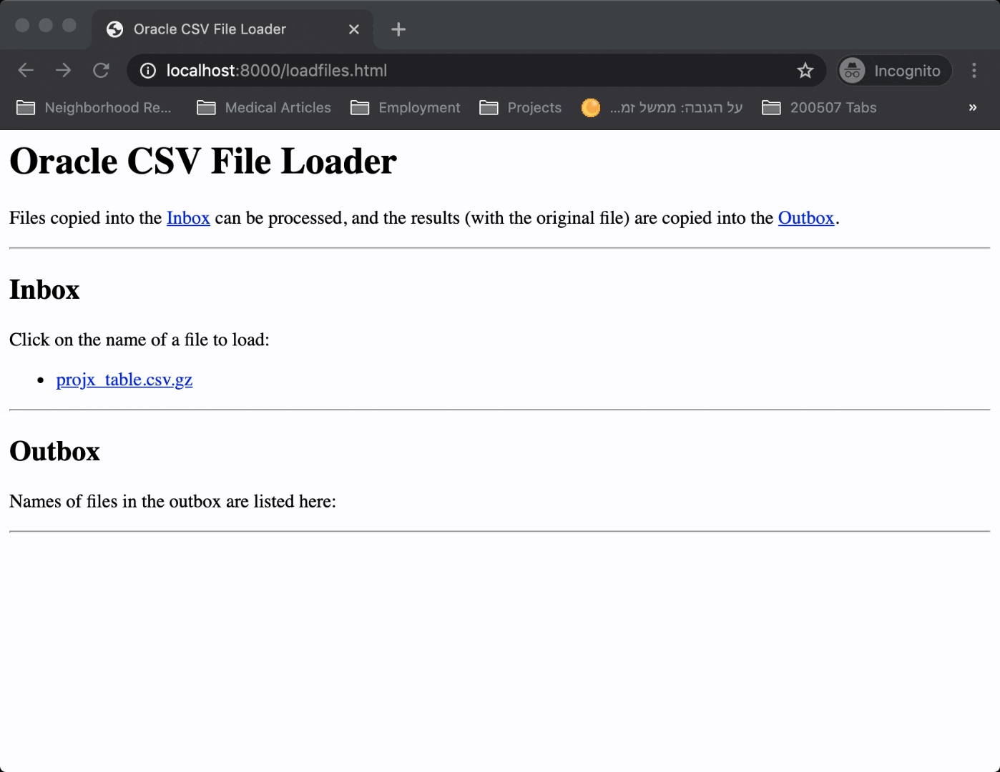

# Oracle CSV File Loader

## Description

### Loading Large CSV Files

Show a reasonably scalable way to bulk load large CSV files
into an Oracle database.

### Delete Duplicate Rows
 
As part of a separate challenge, show an effective way
to drop duplicate entries in a table.
 
## Approach

According to the Oracle White Paper 
[Performant and scalable data loading with Oracle Database 12c](https://www.oracle.com/technetwork/database/bi-datawarehousing/twp-data-loading-oracle-db-12c-2189777.pdf),
the use of "external tables" can be part of a good approach to load large CSV files into Oracle databases.
 
We demonstrate such an approach using a docker container running Oracle 12c, and a simple web interface
(see below) to help visualize the flow of loading CSV files arriving into an "inbox", leaving results
(such as the original file, and the log produced by the loading process) into an "outbox" folder.

Both the "inbox" and "outbox" are mounted volumes attached to the running docker container.



### Constraints

The approach is shown using several "hard-coded" constraints - all of which
could easily be relaxed through parameterization, with a bit more work:

1. a single database schema, conforming to that of the CSV file provided
    in the challenge (see the file in the [sample inbox](vol/README.md)),
    and as described in the "create table" statement of the
    [load_projx_table.sql](src/scripts/load_projx_table.sql) script
1. only compressed CSV files, using [gzip](https://www.gzip.org/)  

### Prerequisites

- a running [docker](https://www.docker.com/products/container-runtime) server.
- an active session with the 
[Oracle Container Registry](https://container-registry.oracle.com/)
is needed to pull the Oracle docker container image

## Building The Docker Image

After logging in to the Oracle Container Registry, you can use the
[build-image.sh](src/build-image.sh) bash script to build the customized
docker image, based upon Oracle's standard 12c database server image.
Alternatively, build it yourself with:

```
$ docker build docker --tag oraldr_image
```

## Running The Application

### First Session

#### Launch the Docker Container

Use the [run-db.sh](bin/run-db.sh) shell script to launch the docker container.
When the database has fully initialized, you'll see the message displayed:

```
Done ! The database is ready for use .
``` 

#### Run the `Sql*Plus` Script

Once the container has completed its initialization, you can run the `Sql*Plus`
script [load_projx_table.sql](src/scripts/load_projx_table.sql) to demonstrate the
technique of loading the CSV file into the database.  See the [example session](#example-session)
below.

#### Use the HTTP RPC Endpoint

You can also use the web interface's HTTP RPC endpoint to load the file
from the `inbox`; e.g.:

```
curl -X POST -d file=projx_table.csv.gz 'http://localhost:8000/cgi-bin/loadfiles.py'
```

### Session Termination

The Docker container should be terminated, and can be removed once its no longer needed.

The following command will shutdown the database but persist its state:

`$ docker stop oraldr_ctr`

To remove the database completely (i.e., delete it), use the `rm` command, e.g.:

`$ docker rm oraldr_ctr`

### Session Continuation

To restart a stopped database session, simply `start` it; e.g.:

`$ docker start oraldr_ctr`

### Example Session

The log below shows how you might load the single compressed CSV file
supplied as example with the repository.

```
$ docker exec -it oraldr_ctr /bin/bash
[root@a425e27df681 /]# su - oracle
[oracle@25af992d5216 ~]$ sqlplus -S / as sysdba @scripts/load_projx_table.sql 'projx_table.csv.gz' 'projx_table' < /dev/null
Invoked to load external file projx_table.csv.gz into table projx_table

Directory created.
Directory created.
Procedure created.

Reading CSV into external table...
old   1: call drop_table_if_exists('&2._ext')
new   1: call drop_table_if_exists('projx_table_ext')

Call completed.

old   1: create table &2._ext(
new   1: create table projx_table_ext(
old  16:     location ('&1')
new  16:     location ('projx_table.csv.gz')

Table created.

Copying external to database table...
old   1: call drop_table_if_exists('&2')
new   1: call drop_table_if_exists('projx_table')

Call completed.

old   1: create table &2
new   1: create table projx_table
old   3: as select * from &2._ext
new   3: as select * from projx_table_ext

Table created.

old   1: select * from &2
new   1: select * from projx_table
       112          1 $1000                10/17                10/16/2017 12:09:53 PM
       113          2 $1200                11/17                10/16/2017 01:14:45 PM
       114          1 $1000                10/17                10/16/2017 02:21:23 PM

Deleting duplicate record(s)
old   2: from &2
new   2: from projx_table
old   5:     from &2
new   5:     from projx_table

1 row deleted.

old   1: select * from &2
new   1: select * from projx_table
       112          1 $1000                10/17                10/16/2017 12:09:53 PM
       113          2 $1200                11/17                10/16/2017 01:14:45 PM

```
